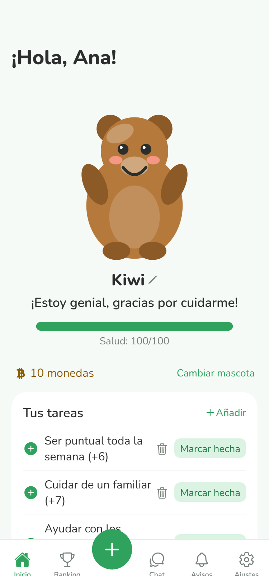
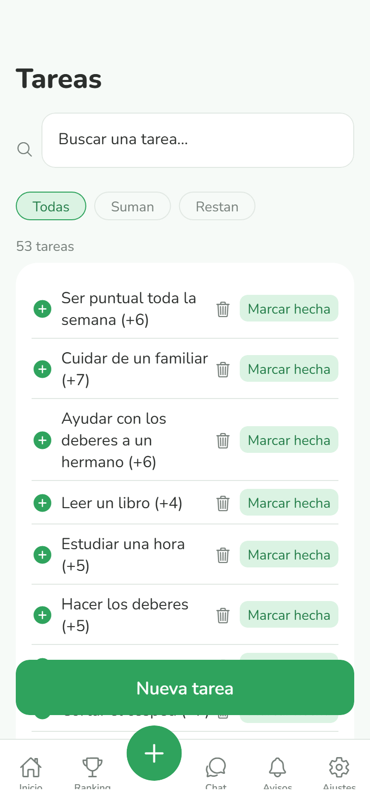
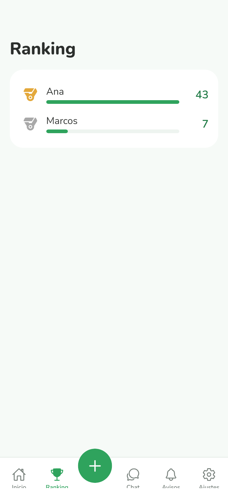
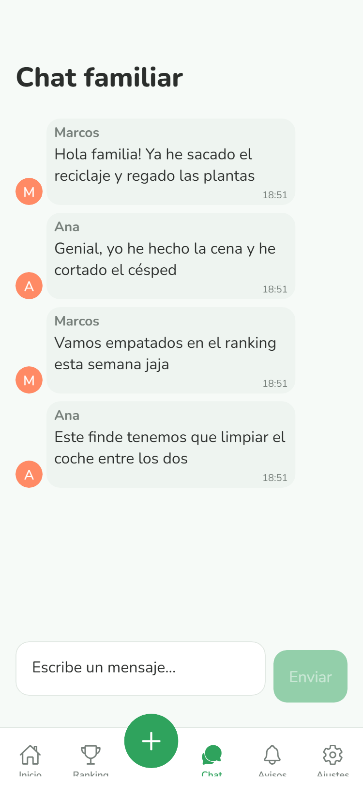
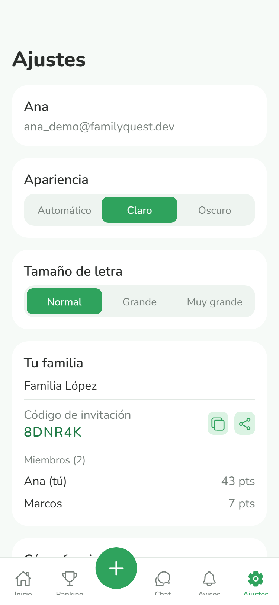

<div align="center">

# 🌱 FamilyQuest

**Gestión de tareas del hogar para toda la familia — con puntos, ranking semanal, chat en tiempo real y una mascota virtual que refleja lo bien que la familia se organiza.**


</div>

---

Pensada para que la use cualquier miembro de la familia sin importar su edad o soltura con la tecnología: interfaz clara, botones grandes, sin jerga técnica, y con una sección de ayuda integrada en la propia app.

## Índice

- [Qué hace](#qué-hace)
- [Capturas](#capturas)
- [Stack técnico](#stack-técnico)
- [Estructura del proyecto](#estructura-del-proyecto)
- [Puesta en marcha](#puesta-en-marcha)
- [Seguridad](#seguridad)
- [Cómo funciona por dentro](#cómo-funciona-por-dentro)
- [Hoja de ruta](#hoja-de-ruta)

## Qué hace

Cada familia tiene su propio espacio privado, al que se accede creando una cuenta y uniéndose con un código de invitación.

| | |
|---|---|
| ✅ **Tareas domésticas con puntos** | Catálogo de más de 50 tareas predefinidas (limpieza, cocina, estudio, cuidado de mascotas...) que suman o restan puntos al completarlas. Con buscador, filtros y creación de tareas propias desde una pantalla dedicada. |
| 🏆 **Ranking semanal** | Compite en equipo por ver quién suma más puntos — se reinicia automáticamente cada semana para que siempre haya una competición fresca. |
| 🐾 **Mascota virtual compartida** | Su salud sube con las tareas positivas y baja con las negativas: es un termómetro visual de cómo va la familia. Personalizable con 6 especies y varios complementos (sombreros, gafas, accesorios), desbloqueables con monedas que la familia gana jugando. |
| 🔔 **Notificaciones de actividad** | Un feed dedicado avisa a toda la familia cuando alguien completa una tarea, con notificaciones locales y push. |
| 💬 **Chat familiar en tiempo real** | Vía WebSockets (Socket.IO), con burbujas de mensaje, scroll automático y estado vacío cuidado. |
| 🌗 **Modo claro/oscuro y tamaño de letra ajustable** | Pensado para que sea cómoda de leer para cualquier edad. |
| 👨‍👩‍👧‍👦 **Gestión de familia** | Ver miembros y sus puntos, copiar o compartir el código de invitación con un botón, salir de la familia cuando se quiera. |

## Capturas

*(Pendiente — coloca aquí capturas reales tomadas desde el móvil con Expo Go.)*

Guarda las imágenes en `docs/screenshots/` con estos nombres y se mostrarán automáticamente:

| Archivo | Pantalla |
|---|---|
| `docs/screenshots/inicio.png` | Inicio (mascota + tareas) |
| `docs/screenshots/tareas.png` | Tareas (búsqueda y filtros) |
| `docs/screenshots/ranking.png` | Ranking |
| `docs/screenshots/chat.png` | Chat |
| `docs/screenshots/ajustes.png` | Ajustes |

```markdown





```

## Stack técnico

| | |
|---|---|
| **Frontend** | React Native + Expo (un único cliente para iOS, Android y web) |
| **Navegación** | React Navigation (pestañas + stack), con un botón central flotante para la acción más habitual |
| **Animaciones** | React Native Reanimated (mascota, transiciones de puntos, chat) |
| **Ilustración** | react-native-svg (mascota dibujada a mano, sin imágenes externas) |
| **Backend** | Node.js + Express 5 |
| **Base de datos** | SQLite (`better-sqlite3`) |
| **Autenticación** | JWT + bcrypt, con autorización por familia en cada endpoint |
| **Tiempo real** | Socket.IO |
| **Notificaciones** | expo-notifications (con stub sin operación en la build web) |

## Estructura del proyecto

```
app-familia/
├── backend/                 API REST + WebSocket
│   ├── db.js                 Esquema de la base de datos y migraciones
│   └── index.js               Rutas, autenticación, lógica de negocio
└── frontend/                App de React Native (Expo)
    ├── components/            Componentes reutilizables (mascota, tareas, chat...)
    ├── context/                Estado global: sesión y tema (React Context)
    ├── navigation/             Navegación por pestañas
    ├── screens/                Una pantalla = un archivo
    └── utils/                  Notificaciones y utilidades
```

## Puesta en marcha

### Requisitos

- [Node.js](https://nodejs.org/) 18 o superior
- La app [Expo Go](https://expo.dev/go) instalada en tu móvil (o un emulador de iOS/Android)
- Backend y móvil conectados a la **misma red WiFi**

### 1. Backend

```bash
cd backend
npm install
```

Crea un archivo `.env` en `backend/` con una clave secreta para firmar los tokens de sesión:

```
JWT_SECRET=escribe-aqui-cualquier-cadena-larga-y-aleatoria
```

Arranca el servidor:

```bash
node index.js
```

Deberías ver `Servidor escuchando en http://localhost:3000`.

### 2. Frontend

```bash
cd frontend
npm install
```

Busca tu IP local (en Windows: `ipconfig`, en macOS/Linux: `ifconfig` o `ip a`) y actualízala en `frontend/constants/config.js`:

```js
export const URL_BASE = 'http://TU_IP_LOCAL:3000';
```

Arranca la app:

```bash
npx expo start
```

Escanea el código QR con la app **Expo Go** desde tu móvil (misma red WiFi que el backend).

> Por ahora la app se distribuye con Expo Go, ideal para desarrollo y para probarla en familia. El siguiente paso natural es empaquetarla con [EAS Build](https://docs.expo.dev/build/introduction/) para generar un `.apk`/`.ipa` instalable de forma independiente — ver [Hoja de ruta](#hoja-de-ruta).

## Seguridad

Cada endpoint que lee o modifica datos de una familia comprueba, en el servidor, que el usuario autenticado (a partir de su JWT) realmente pertenece a esa familia — no basta con conocer un `familia_id` o `usuario_id` para acceder a sus datos. Esto cubre tareas, ranking, mascota, cosméticos, chat y notificaciones. Las contraseñas se guardan con `bcrypt` y nunca se exponen en ninguna respuesta de la API.

## Cómo funciona por dentro

- **Sesión persistente**: el token JWT se guarda en el dispositivo (`AsyncStorage`), así que no hace falta iniciar sesión cada vez que se abre la app.
- **Tema dinámico**: colores y tipografía viven en un `Context` (`TemaContext`) en vez de estar fijados por pantalla, para poder cambiar de modo claro/oscuro y tamaño de letra en caliente.
- **Ranking semanal sin cron**: no hay ningún proceso en segundo plano — cada vez que se consulta la familia se comprueba si ya tocaba reiniciar el ranking (perezoso, pero suficiente para el tamaño de la app).
- **Notificaciones locales vs. push**: los recordatorios y el aviso al completar una tarea son notificaciones locales (no necesitan servidor). El aviso en tiempo real a otros miembros de la familia está preparado en el backend, pero requiere vincular el proyecto a EAS (Expo Application Services) para funcionar de verdad fuera de Expo Go.

## Hoja de ruta

- [ ] Rol de administrador familiar (permisos sobre tareas y miembros)
- [ ] Historial de tareas completadas
- [ ] Notificaciones push reales entre miembros de la familia (requiere EAS)
- [ ] Onboarding para usuarios nuevos
- [ ] Build instalable con EAS (`.apk` / `.ipa`)

---

<div align="center">

Proyecto personal de aprendizaje, construido paso a paso.

</div>
