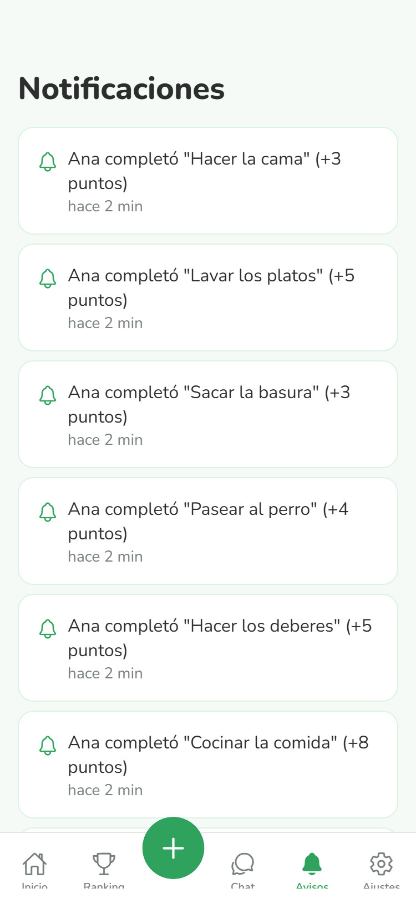

<div align="center">

# 🌱 FamilyQuest

**Household task management for the whole family — with points, a weekly ranking, real-time chat, and a virtual pet that reflects how well the family is keeping up.**


**English · [Español](README.es.md)**

</div>

---

Built so that any family member can use it regardless of age or tech-savviness: clear UI, big buttons, no jargon, and a help section built right into the app.

## Table of contents

- [What it does](#what-it-does)
- [Screenshots](#screenshots)
- [Tech stack](#tech-stack)
- [Project structure](#project-structure)
- [Getting started](#getting-started)
- [Security](#security)
- [How it works under the hood](#how-it-works-under-the-hood)
- [Roadmap](#roadmap)
- [License](#license)

## What it does

Each family gets its own private space, accessed by creating an account and joining with an invite code.

| | |
|---|---|
| ✅ **Household tasks with points** | A catalog of 50+ predefined tasks (cleaning, cooking, studying, pet care...) that add or subtract points when completed. Search, filters, and creating your own tasks from a dedicated screen. |
| 🏆 **Weekly ranking** | Compete as a team to see who scores the most points — it resets automatically every week so there's always a fresh competition. |
| 🐾 **Shared virtual pet** | Its health rises with positive tasks and drops with negative ones: a visual thermometer for how the family is doing. Customizable with 6 species and several accessories (hats, glasses, accessories), unlockable with coins the family earns by playing. |
| 🔔 **Activity notifications** | A dedicated feed lets the whole family know when someone completes a task, with local and push notifications. |
| 💬 **Real-time family chat** | Over WebSockets (Socket.IO), with message bubbles, auto-scroll, and a proper empty state. |
| 🌗 **Light/dark mode and adjustable font size** | Built to be comfortable to read at any age. |
| 👨‍👩‍👧‍👦 **Family management** | See members and their points, copy or share the invite code with one tap, leave the family whenever you want. |

## Screenshots

<div align="center">




</div>

## Tech stack

| | |
|---|---|
| **Frontend** | React Native + Expo (a single client for iOS, Android, and web) |
| **Navigation** | React Navigation (tabs + stack), with a floating center button for the most common action |
| **Animations** | React Native Reanimated (pet, point transitions, chat) |
| **Illustration** | react-native-svg (hand-drawn pet, no external images) |
| **Backend** | Node.js + Express 5, organized in layers (routes / controllers / services) |
| **Validation** | Zod, one schema per endpoint |
| **Database** | SQLite (`better-sqlite3`) |
| **Auth** | JWT + bcrypt, with per-family authorization on every endpoint |
| **Real-time** | Socket.IO |
| **Notifications** | expo-notifications (with a no-op stub on the web build) |

## Project structure

```
app-familia/
├── backend/                    REST API + WebSocket, organized in layers
│   ├── index.js                  Bootstrap: Express, global middleware, mounts the routers
│   ├── socket.js                  Socket.IO handler (connection, per-family rooms)
│   ├── db/
│   │   └── conexion.js              SQLite connection, schema, and migrations
│   ├── middleware/
│   │   ├── auth.js                   JWT verification
│   │   ├── familia.js                 Family-membership / "yourself only" checks
│   │   └── validar.js                 Wraps a Zod schema as Express middleware
│   ├── schemas/                    Zod validation schemas, one per resource
│   ├── routes/                     Endpoints grouped by resource
│   ├── controllers/                 Orchestrate the request and shape the response
│   └── services/                    Business logic and data access
└── frontend/                   React Native (Expo) app
    ├── components/                Reusable components (pet, tasks, chat...)
    ├── context/                    Global state: session and theme (React Context)
    ├── navigation/                 Tab navigation
    ├── screens/                    One screen = one file
    └── utils/                      Notifications and utilities
```

Each backend resource (auth, tareas, familias, chat, mascota, notificaciones) follows the same pattern: `routes/` defines the endpoints and applies the auth/validation middleware, `controllers/` pulls data out of the request and shapes the response, and `services/` holds all the business logic and database queries. An endpoint that needs work from several domains at once (completing a task touches points, pet health, and notifications, for instance) has the main resource's service call into the other services — logic is never duplicated.

## Getting started

### Requirements

- [Node.js](https://nodejs.org/) 18 or higher
- The [Expo Go](https://expo.dev/go) app on your phone (or an iOS/Android emulator)
- Backend and phone on the **same WiFi network**

### 1. Backend

```bash
cd backend
npm install
```

Create a `.env` file in `backend/` with a secret key to sign session tokens:

```
JWT_SECRET=write-any-long-random-string-here
```

Start the server:

```bash
node index.js
```

You should see `Servidor escuchando en http://localhost:3000`.

### 2. Frontend

```bash
cd frontend
npm install
```

Find your local IP (Windows: `ipconfig`; macOS/Linux: `ifconfig` or `ip a`) and update it in `frontend/constants/config.js`:

```js
export const URL_BASE = 'http://YOUR_LOCAL_IP:3000';
```

Start the app:

```bash
npx expo start
```

Scan the QR code with the **Expo Go** app on your phone (same WiFi network as the backend).

> Right now the app ships through Expo Go, which is great for development and testing with the family. The natural next step is packaging it with [EAS Build](https://docs.expo.dev/build/introduction/) to produce a standalone installable `.apk`/`.ipa` — see [Roadmap](#roadmap).

## Security

Every endpoint that reads or modifies a family's data checks, server-side, that the authenticated user (from their JWT) actually belongs to that family — knowing a `familia_id` or `usuario_id` isn't enough to access its data. This covers tasks, ranking, pet, cosmetics, chat, and notifications. Passwords are stored with `bcrypt` and never exposed in any API response. Every endpoint's input is validated with [Zod](https://zod.dev/) before it reaches business logic.

## How it works under the hood

- **Persistent session**: the JWT is stored on the device (`AsyncStorage`), so there's no need to log in every time the app opens.
- **Dynamic theme**: colors and typography live in a `Context` (`TemaContext`) instead of being hardcoded per screen, so light/dark mode and font size can change on the fly.
- **Weekly ranking without a cron job**: there's no background process — every time a family is read, it checks whether a reset was due (lazy, but enough for the size of this app).
- **Local vs. push notifications**: reminders and the "task completed" alert are local notifications (no server needed). Real-time alerts to other family members are wired up in the backend, but need the project linked to EAS (Expo Application Services) to actually work outside of Expo Go.

## Roadmap

- [ ] Family admin role (permissions over tasks and members)
- [ ] History of completed tasks
- [ ] Real push notifications between family members (requires EAS)
- [ ] Onboarding for new users
- [ ] Installable build with EAS (`.apk` / `.ipa`)
- [ ] Automated tests for the backend services

## License

MIT License © 2026 Juan Nadales. See [`LICENSE`](LICENSE) for the full text.
